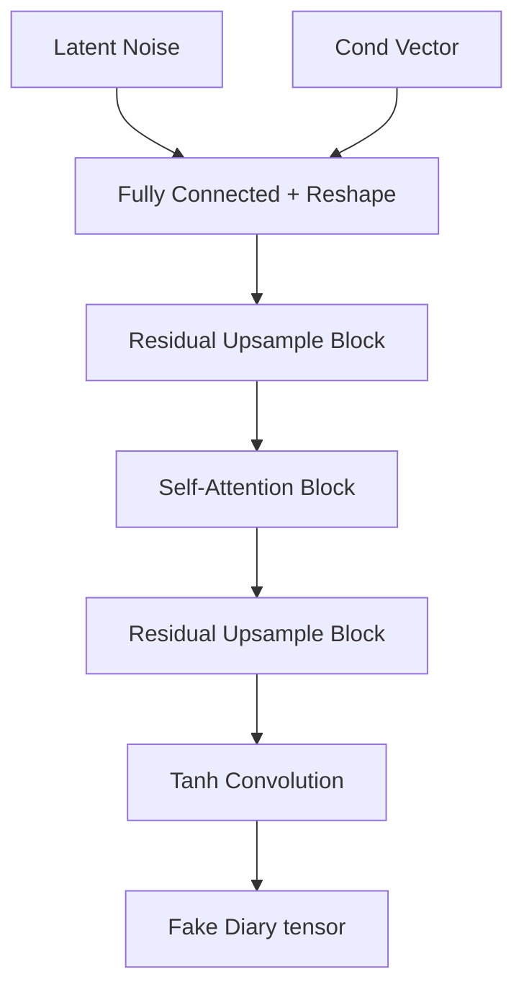

# Tusgan-v2 Development & Change Ledger

This ledger keeps a neat, semantic record of all modifications to the project architecture, training runs, and dataset schemas.

---

### 🗓️ 2026-06-14 10:30 - Initial Project Setup and Transition to v2

> [!NOTE]
> **Category**: `Architecture 🏗️`  
> **Author**: System Setup / Developer

#### 🎯 Intent & Impact
Initialize the `TUS-GAN v2` project codebase, upgrading from the 1-channel prototype to a 9-channel one-hot representation, adding more continuous and discrete conditioning features (State Codes, Household Size, Expenditure Bins) to simulate realistic 24-hour individual activity diaries.

#### 🛠️ Code Modification Details
- Transitioned data representation to support 9 divisions of activity (e.g. sleep, employment, volunteer work).
- Enabled conditional upsampling and downsampling in generator/critic using Conditional Batch Normalization (CBN) and Conditional Instance Normalization (CIN).
- Set up interactive generation app using Streamlit to generate user diaries in real-time.

#### 🧬 Architectural Flow Change
```mermaid
graph TD
    Z[Latent Noise Vector (128)] & C[Demographic Conditions] --> Gen[Conditional Generator]
    Gen --> |Synthetic Diary (B, 9, 48, 1)| Critic[Conditional Critic]
    Real[Real Diaries (B, 9, 48, 1)] --> Critic
    Critic --> |Score / EMD Loss| Optimizer[WGAN-GP Optimizer (beta1=0.0)]
```

#### 📁 Files Touched
- `[generator.py](file:///home/venkat/projects/tusgan-v2/wgan-gp/generator.py)`: Implements conditional transpose convolutions and Conditional Batch Normalization.
- `[critic.py](file:///home/venkat/projects/tusgan-v2/wgan-gp/critic.py)`: Defines Wasserstein critic with Conditional Instance Normalization.
- `[train.py](file:///home/venkat/projects/tusgan-v2/wgan-gp/train.py)`: Main training loop with WGAN-GP loss calculations.
- `[dashboard.py](file:///home/venkat/projects/tusgan-v2/dashboard.py)`: Interactive Streamlit UI dashboard.

---

### 🗓️ 2026-06-14 11:45 - Model Upgrades & Training Loop Enhancements

> [!NOTE]
> **Category**: `Architecture 🏗️`  
> **Author**: Developer / AI Assistant (Antigravity)

#### 🎯 Intent & Impact
Introduce advanced neural network stabilization techniques (Self-Attention, Spectral Normalization, and Residual Connections) to improve the quality of synthesized activity diaries, prevent mode collapse, and stabilize WGAN-GP training. Additionally, optimize the training script with TensorBoard logging, learning rate scheduling, and visual evaluation feedback.

#### 🛠️ Code Modification Details
- **[generator.py](file:///home/venkat/projects/tusgan-v2/wgan-gp/generator.py)**: Added `SelfAttention2d` to capture long-range correlation (e.g. sleep cycles) and upgraded `UpsampleBlock` with residual skip connections.
- **[critic.py](file:///home/venkat/projects/tusgan-v2/wgan-gp/critic.py)**: Added `SelfAttention2d`, `Spectral Normalization` on convolutions and linear output, and residual shortcuts in `DownsampleBlock`.
- **[train.py](file:///home/venkat/projects/tusgan-v2/wgan-gp/train.py)**:
  - Added step learning rate decay schedulers (`StepLR`).
  - Added TensorBoard scalar tracking for Critic/Generator Loss, Gradient Penalty, and learning rates.
  - Implemented periodic visual heatmap generator logging comparing generated vs real diaries every 10 epochs.
  - Added `argparse` configuration support for command-line customization.
  - Optimized `DataLoader` parameters (`pin_memory=True`, `num_workers` multi-processing) for high-performance GPU utilization.


#### 🧬 Architectural Flow Change


#### 📁 Files Touched
- `[generator.py](file:///home/venkat/projects/tusgan-v2/wgan-gp/generator.py)`: Upgraded with residual connections and self-attention.
- `[critic.py](file:///home/venkat/projects/tusgan-v2/wgan-gp/critic.py)`: Upgraded with spectral norm, self-attention, and residual connections.
- `[train.py](file:///home/venkat/projects/tusgan-v2/wgan-gp/train.py)`: Configured schedulers, TensorBoard, visual heatmaps, and resolved dataset paths.

---

### 🗓️ 2026-06-14 13:45 - Documentation Update

> [!NOTE]
> **Category**: `Documentation 📝`  
> **Author**: Developer / AI Assistant (Antigravity)

#### 🎯 Intent & Impact
Update project homepage documentation `README.md` to reflect new architecture changes (Residual connections, Spectral Normalization, Self-Attention), pipeline configurations (argparse, TensorBoard logging, visual heatmap logging), and dataset schemas (State/District variables, NPZ file layout, and CPU subset debugging).

#### 🛠️ Code Modification Details
- **[README.md](file:///home/venkat/projects/tusgan-v2/README.md)**: Completely revised layout with tables outlining the dataset keys and CLI command guides.

---

### 🗓️ 2026-06-14 18:52 - Training Script Format Standardization

> [!NOTE]
> **Category**: `Training 👟`  
> **Author**: Developer / AI Assistant (Antigravity)

#### 🎯 Intent & Impact
Standardize the formatting and execution parameters of the main training script `wgan-gp/train.py` to match the style of `train (1).py` (incorporating explicit section boundaries, a configuration dictionary retrieval function `get_config()`, specific checkpoint functions, Gumbel-Softmax-like logging configurations, and dynamic batch adjustments), ensuring consistent execution behavior and parameters (`--batch`, `--resume`, etc.).

#### 🛠️ Code Modification Details
- **[train.py](file:///home/venkat/projects/tusgan-v2/wgan-gp/train.py)**:
  - Rewrote execution flow using formatting guidelines from `train (1).py`.
  - Structured dataset loader and training configurations as returned dictionary configs.
  - Implemented `save_checkpoint` and `load_checkpoint` functions to support resuming.
  - Integrated command-line arguments mapping (`--data`, `--batch`, `--epochs`, `--n_critic`, etc.) to stay compatible with the user's Colab notebook specifications.
  - Handled data loading constraints gracefully (`max(1, len(loader) // n_critic)`) to avoid training skips on small debug runs.

---

### 🗓️ 2026-06-14 22:34 - Evaluation Script & Dashboard Rewrite

> [!NOTE]
> **Category**: `Architecture 🏗️` / `UI/UX 🎨`  
> **Author**: Developer / AI Assistant (Antigravity)

#### 🎯 Intent & Impact
Rewrite both the evaluation pipeline and the Streamlit dashboard to align with the v2 architecture (9-channel diaries, State+District dual embeddings, new checkpoint format with full optimizer state). The old files had duplicate/garbage code, hardcoded HuggingFace downloads, and incomplete metric calculations.

#### 🛠️ Code Modification Details
- **[evaluate.py](file:///home/venkat/projects/tusgan-v2/wgan-gp/evaluate.py)** (446 lines):
  - Loads Generator from checkpoint `.pt` file and generates synthetic diaries using real conditioning vectors.
  - Computes **Jensen-Shannon Divergence (JSD)** between real and synthetic activity distributions.
  - Computes per-division frequency comparison and average daily minutes per activity.
  - Saves 4 visualization plots: activity distribution bars, time-use comparison bars, 9×48 heatmap comparison, and 5 real vs 5 synthetic step-plot diaries.
  - Full CLI support: `--checkpoint`, `--data`, `--n-samples`, `--output-dir`.

- **[dashboard.py](file:///home/venkat/projects/tusgan-v2/dashboard.py)** (372 lines):
  - Removed HuggingFace Hub dependency; loads model locally from `checkpoints/final.pt`.
  - Uses safe conditioning: samples a real `cond_vector` from the NPZ as a template to avoid one-hot dimension mismatches.
  - Sidebar UI with all demographic controls (Age, Gender, Marital Status, Education, Principal Activity, Day of Week, Sector, Caregiving, District/State sliders).
  - Three visualizations per generated diary: color-coded timeline strip, step plot with activity-shaded background, and time breakdown table.
  - Evaluation page auto-discovers all `*.png` from `evaluation_results/`.

#### 📁 Files Touched
- `[evaluate.py](file:///home/venkat/projects/tusgan-v2/wgan-gp/evaluate.py)`: Complete rewrite with JSD metrics and visual comparisons.
- `[dashboard.py](file:///home/venkat/projects/tusgan-v2/dashboard.py)`: Complete rewrite with local loading and safe conditioning.
